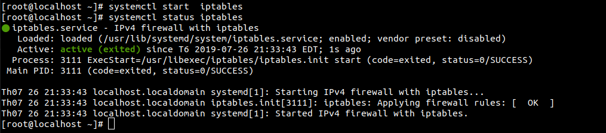

# 1. Tìm hiểu và sử dụng iptables.
Iptables là firewall được cấu hình và hoạt động trên nền console nhỏ và tiện lợi, được tích hợp với kernel của linux. Có khả năng phân tích package hiệu quả. Lọc package dưa vào MAC và một số cờ trong TCP header. Cung cấp chi tiết các tùy chọn đề ghi nhân sự kiện hệ thống. Cung cấp kỹ thuật NAT. Có khả năng ngăn chặn một số cơ chế tấn công theo kiểu DOS.

Iptables cho phép người quản trị Linux cấu hình cho phép chặn luồng dữ liệu đi qua mạng. Iptables có thể đọc, thay đổi, chuyển hướng hoặc hủy các gói tin đi vào và đi ra dựa trên các tables, chains, rules. Mỗi table có nhiều chain chứa các rules khác nhau, quyết định cách thức xử lý gói tin (dựa trên giao thức, địa chỉ nguồn, đích... )

# 2. Cơ chế thành phần của Iptables.

Cơ chế lọc gói tin của iptables được xây dựng trên 3 thành phần cơ bản đó là table, chanin, target.
Mỗi bảng găns thêm các chain để xủ lý cho mỗi giai đoan khác nhau và mỗi giao đoạn có thể tạo ra các rules khác nhau.

## 2.1. Table.
Iptable sử dung table để định nghĩa rules cụ thể cho các gói tin. có 5 loại bảng khác nhau.

### 2.1.1. Filtler table.

- Bảng này được sử dụng để quyết định liệu gói tin có được chuyển đén địa chỉ đích hay không.

### 2.1.2. Mangle table

- Table liên quan đến việc sửa head của gói tin, ví dụ giá trị các trường TTL,MTU, Type of Service.

### 2.1.3. NAT table 
- Table này cho phép route các gói tin đến các host khác nhau trong mạng NAT table các thay đổi IP nguồn và IP đích của gói tin, các gói tin tiếp theo sẽ được ap dụng rules và xủa lý tương tự  nhu gói tin đàu tiên mà không cần phải đi qua bảng NAT.

### 2.1.4. Raw table
- Table  lưu lại trạng thái kết nối của các gói tin, xem câc gói tin rời rac là một kết nói, một session chung để quản lý. Có thể theo dõi số gói tin nhất định, các gói tin đánh dấu NOTRACK sẽ không được ghi lại trong bảng connection tracking.
### 2.1.5. Secure table
- Table này dùng để đánh dấu policy của SElinux lên các gói tin, các dấu này sẽ ảnh hưởng đến cách thức xử lý  của SElinux hoặc của cấc máy khác trong hệ thống có áp dụng SELinux.

- Table này có thể đánh dấu theo từng gói tin hoặc từng kết nối.

## 2.2. Chain 
Mỗi một table đêú có chạin của riêng nó. 
### 2.2.1. Input 
- Chain này dùng kiểm soát hành vi của kết nối đên máy chủ, kiểm tra iptables này có phù hợp với rules trong chain INPUT

### 2.2.2. Forward 
- Chain này được kết nối chuyển tiếp sang một máy chủ khác. Ta chỉ cần đinh tuyến NAT một vài kiể kết nối.

### 2.2.3. Output.
- Chain này sẽ xử ly các kết nôis đi ra ngoài, chain này kiểm tra xem có rules nào có liên quan không trước khi quyết định cho phép ha chặn.

### 2.2.4. Prerouting
- Header của gói tin được chỉnh sủa trước khi routing diến ra.

### 2.2.5. Postrouting
- Header của gói tin được chỉnh sửa sau khi routing diễn ra

## 2.3. Rule 
- Các rule là các tập điều kiện và các hành động tương ứng để xủ lý gói tin. Mỗi chain sẽ chứa rất nhiều rule, gói tin đươc sử lý trong một chain sễ được so lần lượt từng rule trong chain.

- KIểm tra gói tin trên rule rất linh hoạt và có thể dễ dàng mở rộng thêm nhò các extension. Rule có thể dự trên protocol, địa chỉ IP nguồn/ đích, port nguồn/ đích, card mạng, ....

Mỗi rule có một hành động để xử lý gói tin, các hành động như..
- ACCEPT: gói tin được chuyển tiếp sang bảng kết tiếp.
- DROP: gói tin/kết nối sẽ bị hủy, hệ thông không thực thi.
- REJECT: gói tun bị hủy, hệ thông gửi laij một gói tin ICMP
- LOG: gói tin khớp với rule sẻ được ghi lại.
- REDIRECT: chuyển hướng gói tin sang một proxy khác.
- MIRROR: hoán đổi địa chỉ IP nguồn/ đích của gói tin  trước khi gửi gói tin đi
- QUEUE: chuyển gói in tới chương trình của người dùng qua module của kernel.

## 2.4 Các trạng thái của kết nối.
Đây là trạng thái mà hệ thống connection tracking.
- NEW: khi một gói tin được gửi tới và không nằm trong bất kỳ connection nào thì hệ thống dẽ khởi tạo một kết nối mới và găns thẻ NEW cho kết nối này.
- ESTABLISHED: kết nối chuyển từ trạng thái NEW sang ESTABLISHED khi máy chỉ nhận được phẩn hồi từ bên kia.
- RELATED: gói tin gửi không thuộc về kết nối hiên có nhưng liên quan đến  một kết nối đang có trên hệ thống, đây có thể là kết nói phụ trợ.
- INVALID : gói tin không có bất kỳ mối quan hệ nào.
- UNTRACKED: gói tin đi qua bảng raw và được xác địn là không cần theo dõi gói này trong bảng connection tracking.
- SNAT: tráng thái được gán cho ác gói tin mà địa chỉ người đã bị NAT, dùng bởi hệ thông connection tracking để biết khi nào câng thay đổi địa chỉ gơi tin cho các gói tin trả về.
- DNAT: trạng thái được gán cho các gói tin mà địa chỉ đích đã bị NAT, dùng bởi hệ thông connection tracking dể biết khi nào cần thay đôi địa chỉ cho gói tin gửi đi.

# 3. Sử dụng iptables trên Centos 7.

Để sử dụng iptables trên centos 7 ta phải tắt firewalld 
```
systemctl stop firewalld
systemctl mask firewalld
```
Cài đặt gói iptables.
```

```
Bật và đặt iptables khởi động cùng hệ thống.
```
systemctl start iptables
systemctl enable iptables
```
Kiểm tra xem dịch vụ iptables đã hoạt động chưa
```
systemctl status iptables
```


Như vậy iptables đã hoạt động trên centos 7.
# 4. Các  rule cơ bản trong iptables.

